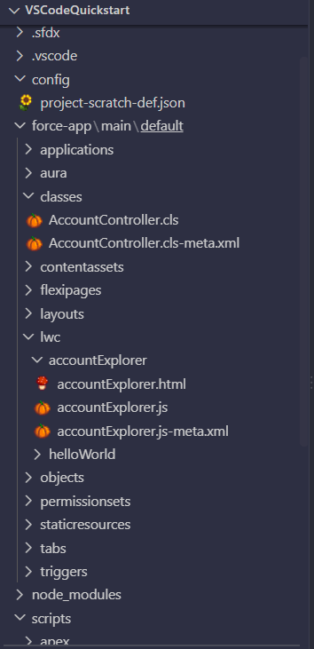
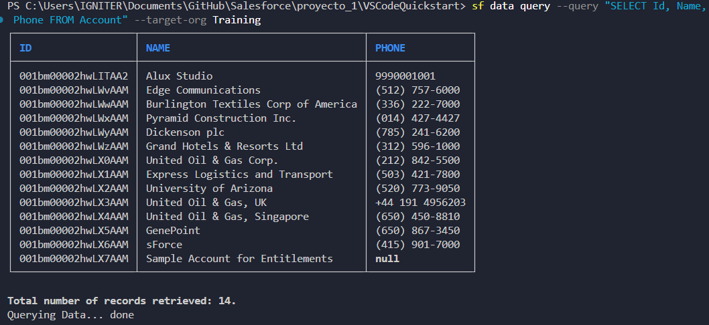
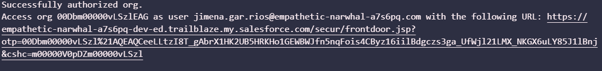
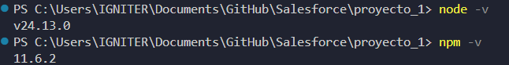
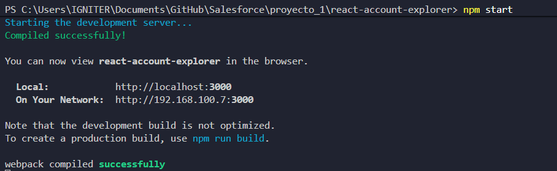
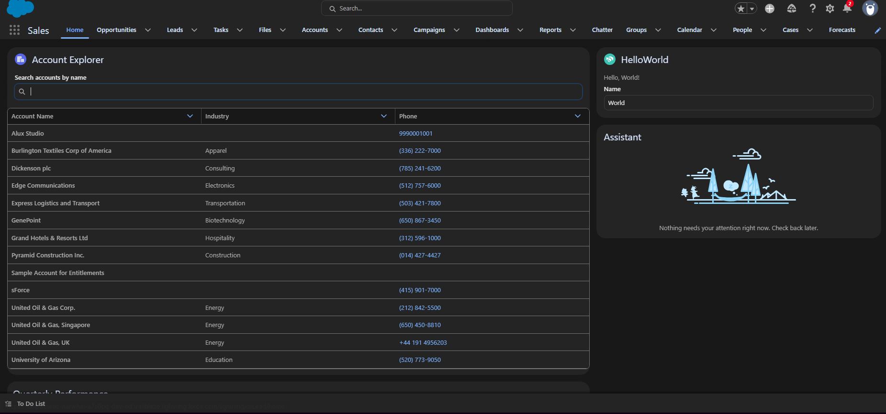
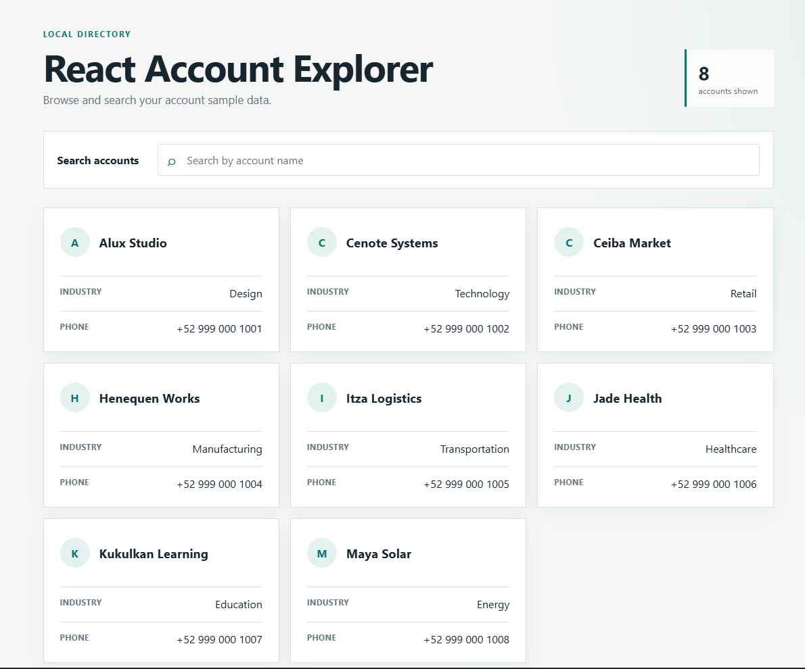

# Professional Readiness Sprint - Account Explorer

**Author:** Jimena Guadalupe García Ríos

***Trailhead account:*** https://www.salesforce.com/trailblazer/djaol8n109yq6u5ct6 

## About This Project
This repository contains my individual submission for the Professional Readiness Sprint. It demonstrates a development workflow by building an Account Explorer interface in two distinct environments:
1. A **Salesforce Lightning Web Component (LWC)** connected to a live Salesforce org.
2. A **React Application** running entirely locally.

## How I Built It
I built this project by usaing prompts to generate the core logic and styling, while manually handling the environment setup and system integrations for both platforms. Following the steps from the required Trailhead Quick Start modules, I configured my local workspace, authenticated the Salesforce CLI, and connected the valid Salesforce DX project to my own org. I also set up my local web development environment, ensuring Node.js and npm were properly installed and verified to run the React application locally.

Once the environments were securely connected and verified, I designed prompts for Copilot to generate the Apex controller, the LWC wiring, and the React components. After the AI provided the foundational code and Salesforce-branded styling, my primary work consisted of parsing the documentation, assembling the components in VS Code, executing the source deployments, and testing the environments to ensure all acceptance criteria were strictly met.

## Project Evidence
As required by the sprint guidelines, screenshots verifying the working environments and deployed projects are included in this repository. 

* **Valid Salesforce DX Project:** 

* **Successful Account Query:** 

* **Salesforce Org Authenticated:** 

* **Node.js, npm, and React Environment:** 
  
  
* **Account Explorer LWC:**

* **React Account Explorer:** 

---

## 1. Salesforce Account Explorer (LWC)
This component lives inside Salesforce and queries Account data (Name, Industry, Phone) directly from the org's database.

### Prerequisites
* Visual Studio Code with the Salesforce Extension Pack.
* Salesforce CLI installed and verified.
* An active Salesforce Org.

### Installation and Deployment
1. Open the terminal and navigate into the Salesforce project directory.
2. Authenticate your Salesforce org by running: 
   `sf org login web`
3. Deploy the source code to your org: 
   `sf project deploy start` (or right-click the `force-app/main/default` folder in VS Code and select "SFDX: Deploy Source to Org").
4. Open your Salesforce org in the browser, go to the Sales App, click the gear icon to "Edit Page", and drag the `accountExplorer` component onto your Lightning page.

---

## 2. React Account Explorer
This is a standalone local web application. It features the same search and filtering logic as the LWC but has absolutely no live connection to Salesforce. It reads data exclusively from a local `Account_Sample_Data.json` file.

### Prerequisites
* Node.js and npm installed on your machine.

### Installation and Running Locally
1. Open a terminal and navigate into the React project directory (e.g., `cd react-account-explorer`).
2. Install the necessary dependencies by running:
   `npm install`
3. Start the local development server:
   `npm start`
4. The application will open automatically in your browser at `http://localhost:3000`.